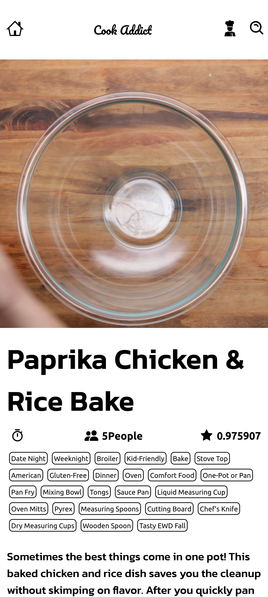

# Cook Addict

> This is the app where you could see information about recipes list, filter and display them.

    

## Built With

- React
- Redux
- HTML
- CSS
- JavaScript
- Webpack
- Jest

## Live Demo

[Live Demo Link on Netlify]()

## Getting Started

Make sur you have the latest version of NodeJS en npm installed locally.

Run the following commands as listed in your terminal:
- git clone https://github.com/patriciachrysy/cook-addict.git
- cd space-travelers
- npm install
- npm run build
- npm start

**Feel free to discover the code and help us improve it**

## Authors

👤 **Manezeu Patricia Chrystelle**

- GitHub: [@githubhandle](https://github.compatriciachrysy)
  

## 🤝 Contributing

Contributions, issues, and feature requests are welcome!

## Show your support

Give a ⭐️ if you like this project!

## Acknowledgments

- Shoutout to designer [Nelson Sakwa](https://www.behance.net/sakwadesignstudio) for [design inspiration on Behance](https://www.behance.net/gallery/31579789/Ballhead-App-(Free-PSDs)) 
- Thank you for Microverse for providing the required materials

## 📝 License

This project is [MIT](./MIT.md) licensed.
